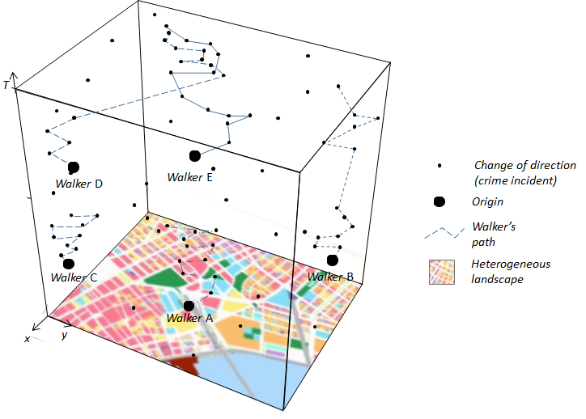
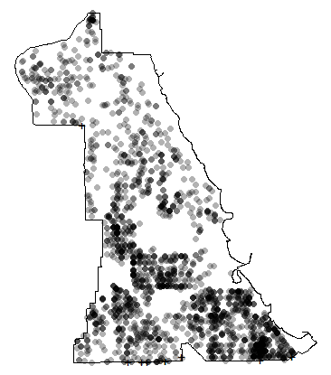
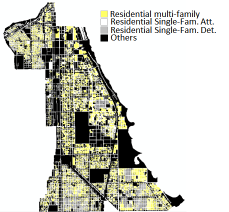
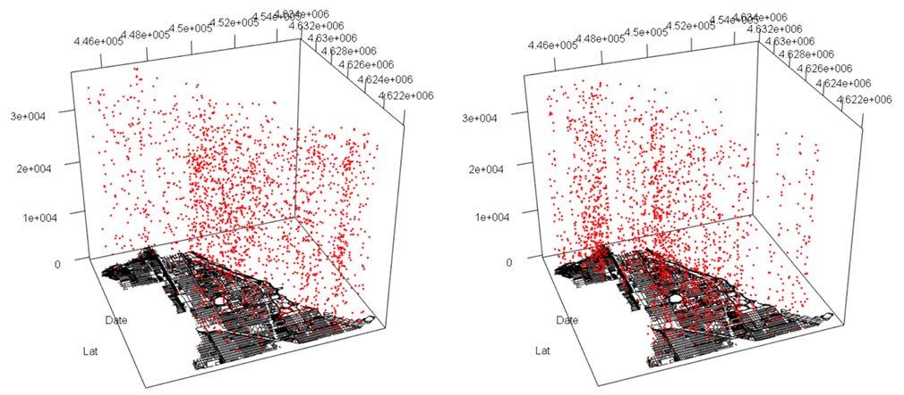
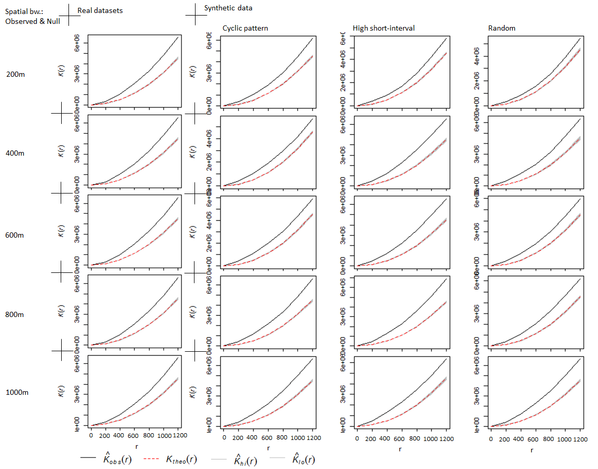
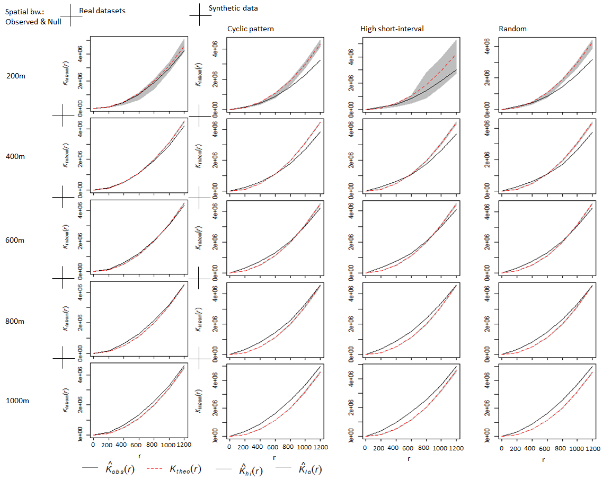
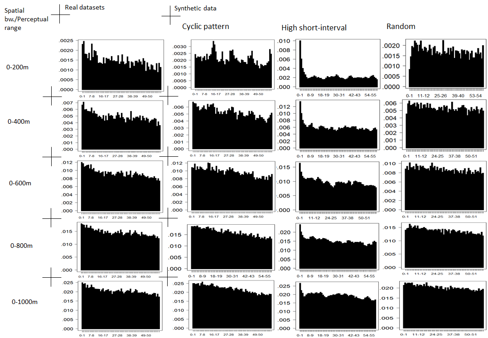

```{r, echo = FALSE}
knitr::opts_chunk$set(
  #out.width = "60%",
  collapse = TRUE,
  comment = "#>",
  fig.path = "README-",
  echo = FALSE
)
```

# Objective

This paper describes the simulation study generating 'synthetic' crime datasets, based on the movement models of optimal foraging animals. At the core of this simulation study is the idea of Levy's walk (Viswanathan, et al., 1999), which comprises of short sequential random movements and occasionally, long transitions by an object, thereby generating point patterns, such as shown in Fig. 1.

```{r, fig.cap="Fig. 1: Levy's walk Model", fig.align="center", out.width = '60%'}

```

The goal of this study is to employ the Levy's walk model to simulate the movements of crime offenders. The primary focus of this study are the spatial, temporal and spatiotemporal characteristics of offenders. The synthetic datasets are then compared with the real datasets using visualisation and statistical techniques, in order to assess how well the simulated datasets describe the real dataset. 

## The real crime datasets

The real crime dataset used here is the South Chicago burglary crime incidents, [downloaded](https://data.cityofchicago.org/Public-Safety/Crimes-2001-to-present/ijzp-q8t2) from the official website of Chicago City. The dataset consist of 2,163 records of burglary incidents that occurred in 2015. See Fig. 2 for the spatial distribution of the crime dataset.

```{r, fig.cap="Fig. 2: The spatial distribution of 2015 real burglary crimes of South Chicago", fig.align="center"}

```

# Criminological background

Drawing ideas from the field of animal ecology, criminologists have likened the re-offending behaviours of certain criminals to the foraging behaviours in animals in order to explain the repeat patterns in crime (Johnson, 2014). Much like foraging animals, some offenders tend to re-victimise the same location (or areas around the previously victimised location) if the potential gains outweigh the risk of being arrested, thereby producing similar point distribution as that of a foraging animal. Although, the decision-making in human offenders is more deliberate than that of animals and therefore, likely to inform repeats over longer time scales, as compared to multiple 'jumps' per day in foraging animals. It is therefore, reasonable to consider sequential decision-making that extends over a number of days for human offenders rather than within the same day. The resultants of these movements are the concentration of incidents such as crime, and in the case of an offender, in terms of space and time. 

Many phenomena relating to crime datasets can be understood by studying the spatial, temporal and spatiotemporal patterns of crime datasets. For example, the repeat victimisation behaviours of burglers have been widely studied by revealing the spatiotemporal patterns inherent in the crime datasets of a given area (Bowers and Johnson, 2005). This study, therefore, focuses on producing synthetic datasets of similar spatial, temporal and spatiotemporal patterns as the real crime datasets.

# The model's calibration

## Spatial component:

The movement model used (i.e. Levy's walk) requires two main parameters in order to control the spatial distribution of resulting point realisation. These are; (1) the spatial location of offenders' origins, and (2) the perceptual range, K. 

**Offender's origin:** This may be considered as the location where an offender lives, and usually marks the start of every day's journey within the study area. The locations of the residential land use are used to infer the offenders' origins. For the South Chicago area, the origins are chosen amongst the three categories of residential buildings (based on the official classification). Probability values are assigned to each category based on visual inspection.  

```{r, fig.cap="Fig. 3: Residential land use of South Chicago", fig.align="center"}

```

**The perceptual range (K)**: of an offender can be defined as the distance (radius) at which the offender perceives his environment, based, for example, on sense of vision, audition, knowledge etc. (Lima and Zollner, 1996). A perceptual range may be likened to the notion of spatial threshold in (spatial analysis), within which the offender evaluates the opportunities around him to evaluate his targets. The size of the perceptual range size may be defined based on expert knowledge, or simply estimated from real data using the likelihood approach.

In this study, a list of the values of K is created in order to synthetise different spatial point distributions. For each simulation, it is assumed that all the offenders have the same perceptual range; an assumption that is unlikely to be true in real life.

#The temporal component:

In crime pattern analysis, a common approach for visualising the repeat pattern (Farrel and Pease, 1993) in crime datasets is to draw the repeat pattern profile (Johnson et al., 1997). The profile is drawn by counting the number of crimes that occur at a given temporal lag distance to one another and calculating the sum of the values across the entire study area. Each counting process is carried out inside a spatial range, which may be considered to be the perceptual range (K), according to this study.

For the purpose of this study, the repeat pattern profiles of the real dataset and the synthetic datasets are generated at varying values of K. In order to describe the repeat pattern profiles, three different temporal patterns are formulated. They are:

**(a) Cyclic pattern:** where there appears a visible cyclic pattern in dataset, such as weekly or fortnightly cycles.

**(b) High 'short-interval' pattern:** where there is a prominent level of repeats at short temporal lags, such as on days of the first week or two weeks.  

**(c) Random pattern:** where the patterns cannot be described in terms of the above two patterns.

For an idea scenario (that is, where all the repeat victimisations occur at exact same location), the first two patterns described above, will be clearly visible. However, due the fact that the most common offending patterns are 'near-repeats' (a situation where the next crime happens close to the location of the initial crime), the space and the time components start to interact. Consequently, it is unlikely to have a perfectly defined cyclic or high 'short-interval' pattern, especially at very large spatial values of K.

#Modelling the offenders' movement#

The general model structure for offenders' movement is defined as a latent variable model where an offender switches between discrete (unobserved) movement behaviour states $z=\{{1,.,Z}\}$, where each state comprises a collection of movement between consecutive positions $(X_{t-1}, Y_{t-1})$ and $(X_t, Y_t)$ for each time step $t=1,...T$. The set of M states can include "exploratory" movements that are not associated with any particular location, or directed movements toward particular locations. For easy modelling, we follow Morales et al., (2004) by selecting a Weibull distribution for the step length $(s_t)$ and a wrapped $(w)$ Cauchy distribution for the direction $\emptyset_t$ of movement. The movement process model is therefore, a discrete-time, continuous space, multi-state random walk (RW) with step length $[s_t|z_t=i]\sim Weibull(a_i,b_i)$ and direction $[\emptyset_t|Z_t=i]\sim wCauchy(\mu_i, \rho_i)$. Then, we have the following probability density function:

$$f(s_t|z_t=i) =\frac{b_i}{a_i}\begin{pmatrix}
s_t\\a_i \end{pmatrix}^{b_i-1}exp[-(s_t/a_i)^b_i]
$$
and 

$$f(\emptyset_t|z_t=i)=\frac{1}{2\pi}\frac{1-p^2_i}{p^2_i-2\rho_icos(\emptyset_t-\mu_i)} $$
For $a_z>0$, $b_z>0$, $0\le\emptyset_t <2\pi,$, $0\le \mu_z<2\pi$, $-1<\rho_z<1$, and $z=1,....,M$. Assuming independence between step length and direction within each movement behaviour state, the joint likelihood for$s_t$ and $\emptyset_t$, conditioned on teh latent state variable $z_t$, is
$$P(s, \emptyset|z)= \prod_{t=1}^{T} f(s_t|z_t, b_{I_t})f(\emptyset_t|z_t)$$
In order to switch between movement behaviour states, a categorical distribution is assigned to the latent state variable $z_t$. In its simplest form, every time step may be assigned to a movement behaviour state independent of previous state: 

$$z_t \sim Categorical(\Psi_i,.....,\Psi_z)$$
Such that $\Psi_i=Pr(z_t=i)$, where $\Psi$ is the fixed probability of being in state $i$ at time $t$, and $\sum^Z_{i=1}\Psi_i=1$. More realistically, a memory can be incorporated into the state using first-order Markov transition matrix to characterise the switches (Blackwell, 2003). For the first-order Markov process, 

$$[z_t|z_{t-1}=k] \sim Categorical(\Psi_{k,i},....,\Psi_{k,z})$$
And $\Psi=Pr(Z_t=i|{t-1=k)}$, for $k=1,....,Z$ where $\Psi_{k,i}$ is the probability of switching from state $k$ at time $t-1$ to state $i$ at time $t$, and $\sum^Z_{i=1}\Psi_{k,i}=1$    

The notion of correlated (biased) walk (CRW) can also be defined. A correlated movement states indicate that a walker exhibits attraction (or aversion) to particular locations (Morales et al., 2004). This can also be incorporated into the movement model formulated. However, if there is a bias towards certain 'centre of attraction' (e.g. certain roads), the successive movement towards such locations would be correlated. Then we have:

$$[\emptyset_t|\emptyset_{t-1},z_t=i] \sim wCauchy(\lambda_{i,t},\rho_i)$$

Where $\emptyset_0$ is the (latent) movement direction prior to time step $t=1$. The expected movement direction $\lambda_{z,t}$ is a weighted average of the strength of bias in the direction of the current centre of attraction $(\mu_{z,t})$ and the previous movement direction $(\emptyset_{t-1})$ for $0 \le \eta_z \le 2 \pi$. If $\eta_z=0$, then movements reverts back to a standard biased random walk. If $\eta_z=1$, then movement becomes an unbiased correlated random walk. If $\rho_i=0$, then movement is a simple (i.e., unbiased and uncorrelated) random walk. If $\rho_i=1$, then movement is biased and deterministic (Barton et al., 2009). In our application to modelling offender's movement, two state random walks are defined, namely; (1) exploratory - indicating a mere exploration of the environment to identify suitable target, and (2) offending - indicating the state at which an offender is motivated to commit an offence. 

One additional parameter - perceptual range, K - must also be considered in relation to foraging pattern within a heterogeneous environment. Perceptual range denoted how the offender perceives the environment in order to make its movement decisions (Lima and Zollner, 1996). During simulations, at each step, the turning angles of the individuals will be biased towards lower resistance areas, and this is evaluated only within the radius of the perceptual range. An individual with a wider perceptual range will be attracted to lower resistance areas, even if it has to cross high resistance areas, because it 'sees' farther. On the contrary, an individual with a small perceptual range will not 'see' those lower resistance areas, so it will be restricted by high resistance areas. This can be implemented by restricting an individual's movement within a circle. 


#The real and the synthetic datasets


**The real dataset can be found here:**

[South Chicago burglary 2015 (2,163 records)](https://github.com/QuantCrimAtLeeds/DataSynth/tree/master/DataSynthUsingR/datasets/real%20dataset])

**Previewing the dataset**

```{r}
dat = read.table(file="datasets/real dataset/chicago_2015_dataset.csv", sep=",", head=TRUE)
head(dat)
```

The following table shows the number of record in each synthetic datasets generated (distinguished by the value of K and the associated temporal pattern): 

```{r}
r = readRDS("extdata/synthetic_Count.rds")
knitr::kable(r[c(1:4)], full_width = F, align=c(rep('c',times=2)), caption = "Table 1. Number of records for the synthetic datasets")
```

Click [here](https://github.com/QuantCrimAtLeeds/DataSynth/blob/master/DataSynthUsingR/datasets/synthetic%20datasets/) to download any of the datasets.

**3D Visualisation of the real and the synthetic datasets**

In Fig. 4, the left plot shows the 3D point distribution of the real dataset, while the right plot shows the 3D point distribution of one of the synthetic data (i.e. cyclic temporal pattern with spatial bandwidth of 200m). 

<!-- #3D Plotting code -->
<!-- ```{r} -->
<!-- library(plot3D) -->
<!-- library(rgdal) -->
<!-- library(rgl) -->
<!-- library(rgeos) -->
<!-- library(raster) -->

<!-- #import the road network -->
<!-- road_Network <- readOGR(dsn=".", "utm_SS_shp") #in projected coordinate system..plot(road_Network) -->

<!-- #converting x,y coord. to spatia point  -->
<!-- crimes_shape <- SpatialPointsDataFrame(syn_Crime[,8:9], syn_Crime, proj4string = coord_Sys)  #X_shape@data -->

<!-- plot3d(crimes_shape@data$x, crimes_shape@data$y,  -->
<!-- 	((as.numeric(crimes_shape@data$date)- min(as.numeric(crimes_shape@data$date)))*100),  -->
<!-- 	  xlab="Long",ylab="Lat",zlab="Date", -->
<!-- 	 grid=TRUE, box=FALSE, col="red") -->
<!-- #adding the basemap -->
<!-- base(road_Network,0,factor=1,col='black',add=TRUE) -->

<!-- ``` -->

```{r, fig.cap="Fig. 4: 3D visualisation of the datasets", fig.align="center"}
out.width = '100%'

```

Click [here](https://github.com/QuantCrimAtLeeds/DataSynth/tree/master/DataSynthUsingR/other%20codes) for the plotting code. 

Comment: The most noticeable difference between the two plot is that the point distribution is denser in the south-east corner and the north-west corner of the study area, for the real dataset and the simulated dataset, respectively.


#Exploration of spatial patterns

Fig. 5 and Fig. 6 show the results of the spatial exploration of both the real and the synthetic datasets. Ripley's K test implemented as the Kest function in `spatstat` R package can be used. Generally referred to as the K-test, the estimate is the reduced second moment function $K(r)$, which examines the level of clustering in a dataset, compared with a theoretical distribution. The estimate of $K(r)$ is of the form,

$$K(r)=\frac{a}{n(n-1)}\sum_{i}\sum_{j}\ I(d_{ij} \le r)e_{ij}$$
Where $a$ is the area of the window (i.e. K), $n$ is the number of data points, and the sum is taken over all ordered pairs of points $i$ and $j$. Here, $d_{ij}$ is the distance between the two points, and $I(d_{ij}\le r)$ is the indicator that equals 1 if the distance is less than or equal to $r$. The term $e_{ij}$ is the edge correction weight. The Ripley's isotropic correction (Ripley, 1988) is used for the edge correction. 

Fig. 5 shows the results of K-test with the Complete Spatial Randomness (CRS) - otherwise referred to as the homogeneous Poisson process - as the underlying theoretical distribution. Fig. 5 shows that the observed estimates (solid black lines) lie well outside the envelopes that define the distribution of 99 simulated theoretical distributions. The CSR assumes that the risk intensity is uniform across the space. Thus, these results imply that the real dataset is significantly clustered than would be expected on the basis of chance; results which seem reasonable considering the clustering of the datasets (inspected visually). The assumption of CSR as the theoretical (baseline) distribution has been widely criticised for its lack of consideration for the dynamism of the underlying risk intensities of geographical point processes in general (Diggle, 2003). 

```{r, fig.cap="Fig. 5. The Ripley's K estimates for the real and synthetic datasets, using the CSR as the theoretical distribution. The black (solid) lines represent the observed estimates. The red (dotted) lines represent the mean simulated estimates, bounded by the maximum and the minimum simulated estimates, across all distances.", fig.align="center"}
out.width = '100%'

```
In reality, we expect the underlying intensity of a point process, such as crime, to vary across space, due to the heterogeneous nature of the urban environment. For example, risk of offending may vary in localised regions as a function of the land use or the local population density of the regions. This spatial structure may take many forms, from simple linear gradient to more complex structuring. When the theoretical distribution is defined so as to capture these underlying structures, we have an inhomogeneous Poisson process (Diggle, 2003).  

In Fig. 6, the theoretical distribution envelopes are now defined as an inhomogeneous Poisson process by fitting a Gaussian density model to the original datasets. This however, violates the symmetry principle that is essential to the validity of simulation envelopes; which requires that both the observed and simulated patterns be subjected to the same method of intensity estimation. This approach is however, used here for convenience. 

For the real datasets, the Gaussian densities are modelled using different values of spatial bandwidths (i.e. 200m, 400m, .., 1000m). For the simulated datasets, the Gaussian densities are modelled by setting the K value that was originally used to generate the data at the spatial bandwidths.

```{r, fig.cap="Fig. 6: The Ripley's K estimates for the real datasets; using the Inhomogeneous Poisson model (with varying bandwidths) to define the theoretical distribution. The black (solid) lines represent the observed estimates. The red (dotted) lines represent the mean simulated estimates, bounded by the maximum and the minimum simulated estimates, across all distances.", fig.align="center"}
out.width = '100%'

```

Compared to Fig. 5, we can see that both the observed and the Inhomogeneous Poisson model (Gaussian densities) appear closer to one another. For the real dataset, both models appear to describe each other better, at spatial bandwidths of 200m, 400m and 600m, while diverging at bandwidths of 800m and 1000m. For the simulated datasets, the theoretical estimates only appear to describe the observed estimates when K and r are similar. For example, at K=400m, both estimates appear to coincide at around r=400m and 600m, for all three synthetic datasets. However, both patterns start to diverge very significantly at larger values of K. This explains the fact that as the perceptual range increases, the spatial coverages of the offenders begin to overlap and the spatial distribution of the crimes may not be well-defined anymore. `Click here to see the code for the K-test`

#Exploration of temporal patterns#

Fig. 7 shows the repeat pattern profiles of both the real dataset and the synthetic datasets, estimated at 1-day temporal lag distances up to 60 days. The profiles can be used to describe the temporal interactions within the datasets. In order to eliminate the edge effects, the last 60 days of the datasets are adjusted to compensate for the crime counts at longer temporal lag distances. The final crime counts are then standardised using the number of eligible cells of the reference date. The profiles are generated at different spatial bandwidths/perceptual ranges, as shown in Fig. 7. 


```{r, fig.cap="Fig. 7: Repeat pattern profiles of the real dataset and the synthetic datasets", fig.align="center"}
out.width = '100%'

```

From Fig. 7, the temporal patterns of the real dataset are less well-defined, as compared to the synthetic datasets. This is due to the fact that the synthesised offenders are assumed to be operating at a uniform perceptual range (spatial bandwidth) and that their temporal patterns are similar. The temporal patterns at smaller spatial ranges (bandwidths), such as 0-200m, are able to explain these two assumptions, since there is less intermingling of the activities of different offenders. At larger bandwidths, however, the spatial and temporal distribution of the crime points start to interact, giving rise to spatiotemporal interactions. In conclusion, we can say that the real dataset does not appear to be well-defined, primarily because the assumption of the uniform perceptual range (K) does not hold. 

#Exploration of spatiotemporal interactions#
 
#The R-codes for simulating the synthetic data#

```{r include = FALSE}
library(rgdal)
library(rgl)
library(sp)
library(rgeos)
library(raster)
library(maptools)
library(SiMRiv)

```

```{r}

#importing the land use data
offenders_Origin <- readShapeSpatial('shapefiles/all_landuse_SS_UTM.shp')
proj4string(offenders_Origin) <- "+proj=utm +zone=16 +ellps=clrk66 +units=m +no_defs" # specify projection
#plot(landuse)


#plotting the landuse map
# colPallete<-c("green","blue","yellow","grey")
# landuseColors <- colPallete[offenders_Origin$col_ID]
# plot(offenders_Origin, col=landuseColors) 
# leg.txt <-c("l1", "l2", "l3", "l4")
# legend("right",   # location of legend
# 	legend=unique(offenders_Origin$col_ID), # categories or elements to render in 
#              # the legend
#       fill=colPallete) # color pa

#extracting the centroid coordinates of the three residential buildings categories
res_SF_Det <- offenders_Origin[which(offenders_Origin$col_ID==1),]
res_SF_Det <- cbind(res_SF_Det$ID, as.data.frame(res_SF_Det$x), as.data.frame(res_SF_Det$y))
colnames(res_SF_Det) <-  c("ID","x","y")

res_SF_Att <- offenders_Origin[which(offenders_Origin$col_ID==2),]
res_SF_Att <- cbind(res_SF_Att$ID, as.data.frame(res_SF_Att$x), as.data.frame(res_SF_Att$y))
colnames(res_SF_Att) <-  c("ID","x","y")

res_MF <- offenders_Origin[which(offenders_Origin$col_ID==3),]
res_MF <- cbind(res_MF$ID, as.data.frame(res_MF$x), as.data.frame(res_MF$y))
colnames(res_MF) <-  c("ID","x","y")

#importing the street network shapefile
road_Network <- readShapeSpatial('shapefiles/utm_SS_shp.shp')
proj4string(road_Network) <- "+proj=utm +zone=16 +ellps=clrk66 +units=m +no_defs" # specify projection

#this code create an image map of two classes:
#class1: road network (of resistance zero), that allowing offenders move through. The road is buffered by 15m
#class2: the background (of resistance 0.95 (Prob.value)), ensuring that offenders' movement is only restricted to the road
landuse_map <- resistanceFromShape(road_Network, res = 5,
	buffer=15, background = 0.95, margin = 10)
#plot(landuse_map)

#PARAMETER DEFINITIONS

#variable to store crime records (details)
offender_Info <- list()

#TEMPORAL PARAMETERS
#specify the temporal pattern to simulate 
#"1" for "cyclic",
#"2" for "high_short_interval", 
#"3" for "random_T_clustering_
#Each option corresponds to a "transition matrix" embedded to simulate the temporal pattern 

temporal_pattern_to_simulate <- 1

#the three temporal patterns are distinguished in terms of the transition matrix selected.

#number of days to simulate
n_days <- 365

#start date for the simulation
start_Date <- as.Date("2015-01-01")

#------------------------
#number of offenders to simulate
n_walkers <- 300
#-------------------------

#SPATIAL PARAMETERS
#Selecting (from the three residential landuse ids: 1, 2, 3) to represent the distribution of offenders' origins amongst the three categories
offenders_Origin_cood <- sample(c(1,2,3), size=n_walkers, replace=TRUE, prob=c(0.05,0.15,0.8))

#perceptual range to simulate (in metres)
p_range <- 200

#offenders' movement step (in metres)
step_length <- 20


#---------------------------------------------------------
#SIMULATION STARTS
#simulating all the crimes committed by offenders, one offender at a time.
for(id in 1:n_walkers){##123 #id<-1

#based on the list of residentl. land use ids created,  randomly select a starting location for the offender from the land use category
if(offenders_Origin_cood[id]==1){#1
init <- matrix(as.matrix(res_SF_Det[sample(1:nrow(res_SF_Det), size=1, replace=TRUE),2:3]), ,2)
}#1
  
if(offenders_Origin_cood[id]==2){#1
init <- matrix(as.matrix(res_SF_Att[sample(1:nrow(res_SF_Att), size=1, replace=TRUE),2:3]), ,2)
}#1
if(offenders_Origin_cood[id]==3){#1
init <- matrix(as.matrix(res_MF[sample(1:nrow(res_MF), size=1, replace=TRUE),2:3]), ,2)
}#1


#Define a three-state movement behaviour for the offender (Levy walk),
#State 1: "Exploring"
#State 2: "Exploring but motivated"
#State 3: "Offending" (correlation probability of 0.98)
#Offending only occur at State 3.

#------------------------------------
#To simulate "cyclic" temporal pattern
if(temporal_pattern_to_simulate == 1){
levy.walker <- species(state.RW() + state.RW() + state.CRW(0.98),
trans = transitionMatrix(0.5, 0.0001, 0.5, 0.028, 0.5, 0.5)) 
}

#------------------------------------
#To simulate "high short-interval" temporal pattern
if(temporal_pattern_to_simulate == 2){
levy.walker <- species(state.RW() + state.RW() + state.CRW(0.98),
trans = transitionMatrix(0.5, 0.0001, 0.5, 0.022, 0.5, 0.05))
}

#------------------------------------
#To simulate "random" temporal pattern
if(temporal_pattern_to_simulate == 3){
levy.walker <- species(state.RW() + state.RW() + state.CRW(0.98),
trans = transitionMatrix(0.5, 0.0001, 0.5, 0.041, 0.5, 0.5))
}

#adding the time steps and perceptual range
levy.walker <- (levy.walker + step_length) * p_range

crimes_Committed <- NULL

#simulation
sim.lw.road <- simulate(levy.walker, n_days,
  resist = landuse_map, coords = init)

#combining the dates of occurences
sim.lw.road <- cbind(sim.lw.road, as.data.frame(start_Date))
colnames(sim.lw.road) <- c("x", "y", "state", "date")

sim.lw.road[,4] <- sim.lw.road[,4] + (1:length(sim.lw.road[,4])-1)

#manually adding cyclic effects 
#----------------------------
if(temporal_pattern_to_simulate == 1){
aaa<-c(1,2,3,4)
crime_T <- sample(aaa, 1, replace=TRUE)

index_Counter <- 0
for(hh in 1: crime_T){#hh<-1
if(hh==1){
init_V <- sample(1:60, 1)
index_Counter <- index_Counter + init_V
	sim.lw.road[index_Counter,3] <- 2
	}
if(hh!=1){
bbb<-c(sample(1:3, 1,prob=c(0.3,0.2,0.1)), sample(13:16,1,prob=c(0.2,0.3,0.3,0.2)), 
	sample(28:31, 1,prob=c(0.2,0.3,0.3,0.2)),sample(43:46, 1,prob=c(0.2,0.3,0.3,0.2)),
	sample(58:60, 1,prob=c(0.1,0.2,0.3)))

init_V <- sample(bbb, 1, replace=TRUE)
index_Counter <- index_Counter + init_V
if(index_Counter<=n_days){#0909
		sim.lw.road[index_Counter,3]<-2
			}#0909
		}
	}#hh
}
#----------------------------

#alternatively (for temporal patterns "2" and "3")
#if(temporal_pattern_to_simulate != 1){
crimes_details <- sim.lw.road[which(sim.lw.road[,3]==2),]
#}


if(nrow(crimes_details)>=1){#4545
crimes_details <- sim.lw.road[which(sim.lw.road[,3]==2),]

crimes_details <- cbind(crimes_details, id)  #id<-1

crimes_Committed <- rbind(crimes_Committed, crimes_details)

#the_Count <- c(the_Count, nrow(crimes_Committed))

}#4545


#flush.console()
#print(id)

offender_ID <- id
offender_init_Coord <- init
combine_Result <- list(offender_ID, offender_init_Coord, crimes_Committed)
offender_Info[id] <- list(combine_Result)

}##123

#reset the "temporal pattern to simulate" to the default value of 1
temporal_pattern_to_simulate <- 1

#SIMULATION ENDS
#---------------------------------------------------------


#this code to unpack the synthetic dataset into a matrix format
all_crimes <- NULL
for(j in 1:length(offender_Info)){#j<-1
	crimes <- offender_Info[[j]][[3]]
n_row <- nrow(crimes)
if(!is.null(n_row)){
#if(n_row!=0){
	crimes_ID <- offender_Info[[j]][[1]]
	all_crimes <- rbind(all_crimes, crimes)	
	 }
	}#

#-------------------------------------------------------#nrow(all_crimes)
#displaying crime 'committed' by the first three offenders throughout the period of simulation
offenders_1_to_5 <- all_crimes[which(all_crimes$id%in%c(1:3)),]

offenders_1_to_5
paste("Total number of crimes:",nrow(all_crimes), sep="   ")
#-------------------------------------------------------


```

#References#

Bowers, K.J. and Johnson, S.D., 2005. Domestic burglary repeats and space-time clusters: The dimensions of risk. European Journal of Criminology, 2(1), pp.67-92.

Farrell, G. and Pease, K., 1993. Once bitten, twice bitten: Repeat victimisation and its implications for crime prevention. ? Crown Copyright.

Johnson, S.D., 2014. How do offenders choose where to offend? Perspectives from animal foraging. Legal and Criminological Psychology, 19(2), pp.193-210

Johnson, S.D., Bowers, K. and Hirschfield, A., 1997. New insights into the spatial and temporal distribution of repeat victimization. The British Journal of Criminology, 37(2), pp.224-241.

Johnson, S.D., Bowers, K. and Hirschfield, A., 1997. New insights into the spatial and temporal distribution of repeat victimization. The British Journal of Criminology, 37(2), pp.224-241.

Lima, S.L. and Zollner, P.A., 1996. Towards a behavioral ecology of ecological landscapes. Trends in Ecology & Evolution, 11(3), pp.131-135.

Morales, J.M., Haydon, D.T., Frair, J., Holsinger, K.E. and Fryxell, J.M., 2004. Extracting more out of relocation data: building movement models as mixtures of random walks. Ecology, 85(9), pp.2436-2445.

Ripley, B.D., 1988. Statistical inference for spatial processes. Cambridge university press.

Viswanathan, G.M., Buldyrev, S.V., Havlin, S., Da Luz, M.G.E., Raposo, E.P. and Stanley, H.E., 1999. Optimizing the success of random searches. Nature, 401(6756), pp.911-914. 


